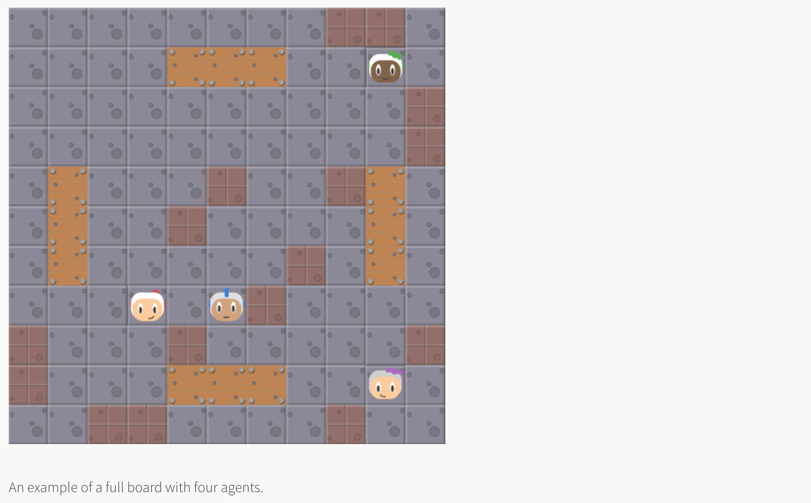
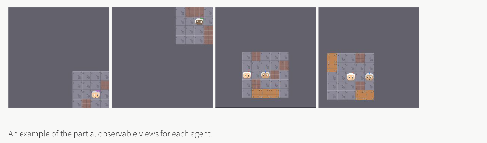
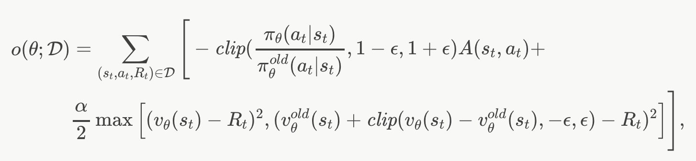
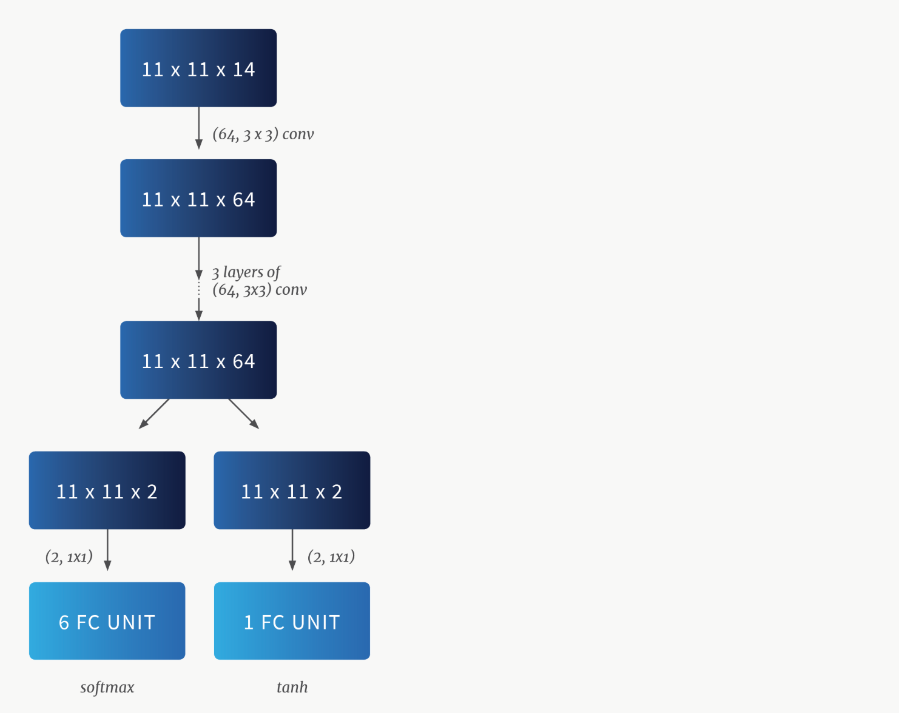
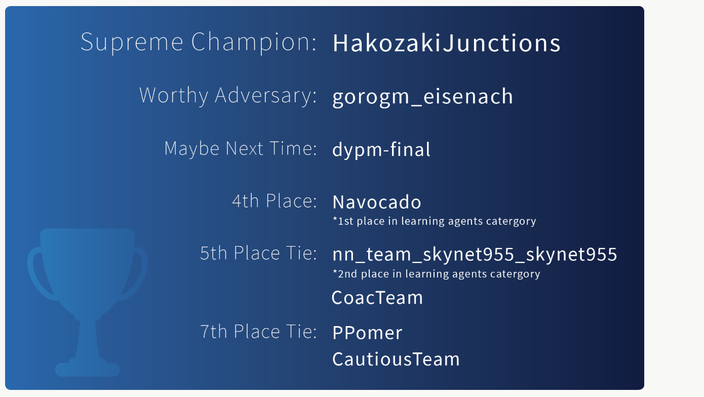

# Pommerman

Team competition : 2018. 12. 8 NeurIPS 컨퍼런스에서 진행됨

### 2nd Place in learning agents _ Skynet (5th place in global rank)

original blog : https://www.borealisai.com/en/blog/pommerman-team-competition-or-how-we-learned-stop-worrying-and-love-battle/

[Blog 번역글]

### 1. The rules of engagement

- Pommerman team competition은 4개의 bomber 에이전트로 구성

- 각 에이전트는 11x11 사이즈 보드판의 각 코너에 놓이게 됨
- 2개의 팀이며 각 팀에 2개의 에이전트로 구성

#### Rules

- 매 타임스텝마다 각 에이전트는 6개의 행동 중 하나를 실행할 수 있다. 행동은 상하좌우로 움직이거나 제자리에 있거나 폭탄을 놓는 것이다.
- 보드의 각 셀은 통로, 부숴지지 않는 단단한 벽, 폭탄으로 부술 수 있는 나무판으로 구성될 수 있다.
- 게임 맵은 랜덤하게 생성되나 에이전트 들 사이의 통로는 보장되고 점차적으로 생성되는 맵은 플레이 할 수 있도록 보장된다.
- 에이전트가 폭탄을 놓으면 10 타임스텝 이후에 폭발하며 불길은 2 타임스템 동안 유지된다. 불길은 나무 판을 제거하고 불길 범위에 있는 에이전트를 죽일 수 있다. 나무판이 부숴지면 통로가 나타나거나 아이템이 나온다.
- 아이템은 에이전트의 능력을 강화시켜주는데 세 가지 종류가 있다. 1) 폭탄의 불길 범위가 늘어나거나 2) 에이전트가 놓을 수 있는 폭탄의 개수가 증가하거나, 폭탄을 찰 수 있는 능력을 갖게된다.
- 각 게임 에피소드는 최대 800 타임스텝이며 게임 종류에는 2가지 조건이 있다. 한 쪽 팀이 이기거나 800 타임스텝을 다 채우게 되면 게임은 종료된다.

### 2. Challenges

 : Pommerman team competition은 강화학습에 있어 도전적인 문제이다. 그에 대한 이유로는 아래와 같다.

- **Sparse, delayed reward** : 에이전트는 게임이 종료될 때까지 어떤 보상도 받지 못한다. 보상은 +1 또는 -1이다. 양쪽 팀의 에이전트가 같은 타임스텝에서 모두 죽게 되면 각각 -1을 받고 일시적인 신뢰 할당 문제(credit-assignment problem)를 만든다. 신뢰 할당 문제는 sparse하고 delayed 되는 보상으로 부터 원자적 행동에 대한 보상 문제를 해결하려고 한다.
- **Noisy rewards** : Pommerman 게임에서 관찰되는 보상들이 잠재적인 자살행위로 인해 노이즈가 발생할 수 있다. 예를 들면, 오직 두 에이전트가 있는 간단한 게임 시나리오를 생각해보면, 이 경우 우리의 학습 에이전트와 상대가 있을 것이다. 우리는 (우리의 학습 에이전트의 전투 스킬이 아닌) 상대의 자살로 인해 우리의 에이전트가 +1의 보상으 받게 되는 false positive 에피소드와 우리 에이전트의 자살로 인해 -1의 보상을 받게 되는 false negative 에피소드를 고려할 수 있다. False negative 에피소드는 model-free RL 내에서 순수한 탐험을 통해 합리적인 행동을 학습하는데 있어 주요한 걸림돌이다. 또한 false positive 에피소드는 상대방과 적극적으로 부딪히기 보다 camping과 같은 임의의 정책에 대해 에이전트에게 보상을 줄 수 있다.

- **Partial observability** : 에이전트는 오직 그들의 주위만 볼 수 있다. 예로 에이전트는 에이전트의 관찰 범위보다 불길의 길이가 더 길다면 폭탄을 보지 못한 채로 죽을 수 있다. 다른 문제는 에이전트에 의해 차여진 후 폭탄이 움직였을 때 발생한다. 폭탄은 발사체로 변하여 연쇄 폭발을 일으켜 환경을 매우 확률적인 곳으로 만들게 된다.

- **Vast search space** : 

- **Lack of a fast-forward simulator** : 

- **Difficulty of learning to place a bomb** :

- **Multi-agent challenges** : 

- **Opponent generalization challenge** : Pommerman 시뮬레이터는 SimpleAgent라는 스크립팅 된(규칙 기반) 에이전트가 제공된다. SimpleAgent는 power-ups를 수집하고 상대가 근처에 있을 때 폭탄을 배치한다. 이 에이전트는 폭탄의 불길을 피하는데 비교적 능숙하며 각 타임스텝마다 다익스트라 알고리즘을 사용한다. SimpleAgent의 행동은 확률적이고 수집된 power-ups에 따라 행동이 변경된다. 예로, 에이전트가 여러개의 ammo power-ups를 수집했다면 이 에이전트는 많은 폭탄을 배치할 수 있고 이것은 연쇄 폭발을 일으키고 또는 더 자주 자살 할 수 있다. 예비 실험에서 우리는 우리의 에이전트를 SimpleAgent를 상대로 학습했다. 우리의 학습된 에이전트는 상대의 취약한 점을 이용하여 게임에서 이기는 법을 학습했다.

  * video : <https://youtu.be/3yUhI46Xx8o>

  > *Our learning agent (white) is highly skilled against a SimpleAgent. It avoids the blasts and also learns how to trick SimpleAgent to commit suicide in order to win without  having to place any bombs.*

우리가 SimpleAgent를 상대로 우리의 학습 에이전트의 행동을 조사할 때, 우리는 우리의 에이전트가 어떻게 하면 SimpleAgent라 자살하도록 유도하는지 학습했다는 것을 알았다. SimpleAgent가 처음 폭탄을 놓을때 이웃하는 칸 X으로 움직이는 행동을 한다. 이 행동을 배운 후 에이전트는 

### 3. Our Skynet team

Skynet team은 단일 신경망으로 되어 있으며 다섯가지 단계를 기반으로 한다.

1. parameter sharing
2. reward shaping
3. an Action Filter module
4. opponent curriculum learning
5. an efficient RL algorithm

우리는 **파라미터 공유 방식**을 사용한다. 즉, 우리는 에이전트들이 단일 네트워크의 파라미터를 공유할 수 있도록 했다. 이것은 두 에이전트의 경험을 통해 네트워크가 학습되도록 한다. 그러나 이것은 또한 각각의 에이전트가 다른 시각을 갖기 때문에 에이전트 간의 다양한 행동들을 허용하도록 한다. 

게다가 우리는 에이전트가 학습 성능을 향상하도록 **dense reward**를 추가했다. 우리는 에이전트들에게 그들의 행동에 대한 의미있는 기여를 제공하는 다른 보상 방식으로 부터 영감을 얻었다. 이것은 단순히 단일 글로벌 보상을 사용하는 것과는 대조적이다.

세번째로 **ActionFilter 모듈**은 에이전트에게 사전 지식을 넣지 말아야한다는 것을 알려줌으로써 구현되었으며, 에이전트는 시행 착오를 통해 무엇을 해야하는지 알아내도록 했다. 이점은 두가지 인데 1) 학습 문제가 단순화 되었고 2) 에이전트가 불길을 피하거나 폭탄을 피하는 것과 같은 피상적인 기술들이 완벽하게 습득되었다.

위의 Action Filter가 RL 학습을 심각하게 늦추지 않았다는 것을 언급할 필요가 있다. (이것은 매우 빨랐다.) 신경망 평가와 함께 각 액션은 여전히 수 밀리초가 걸리며 이 속도는 순수한 신경망이 forward 추론하는 것과 거의 같은 속도이다. 경기에서의 시간 제한은 한 움직임당 100ms 이다.

신경망은 PPO로 학습되었다.

$\theta$ is the neural net, D is sampled by $\pi_\theta^{old}$, $\epsilon$ is a tuning parameter. (자세한 것은 PPO 논문 참고)

우리는 우리의 팀이 일련의 커리큘럼을 가진 상대들과 경쟁하도록 했다.

- **Static opponent teams** : 상대는 움직이지 않으며 폭탄을 놓지도 않음
- **SmartRandomNoBomb** : 폭탄을 놓지는 않으나 이것은 'smart random'이다. 예로, 그들은 위에 언급한 action filter를 가진다.

우리가 상대가 폭탄을 놓지 않도록 한 이유는 신경망이 진정한 'blasting'기술을 학습하는데 집중할 수 있다는 것을 알았고 상대가 실수로 자살하는 행동에 의존하는 기술이 아니라는 것을 알았기 때문이다. 또한 이 전략은 상대의 비자발적인 자살로 인한 'false positive'보상 신호에 의한 학습을 피할 수 있다.

아래 이미지를 보면 아키텍처는 먼저 4개의 convolution 층을 반복하고 두개의 policy 그리고 value head를 반복한다.

LSTM을 이용해 관찰 내역을 추적하는 대신 보드의 각 칸의 최신 값을 추적하는 'retrospective board'를 사용했다. 에이전트의 시야 밖의 칸들의 경우, 'retrospective board'는 보드의 관찰되지 않은 요소를 가장 최근에 관찰된 요소로 채웠다. 입력 feature는 총 14개의 면을 계산한다. 처음 10개의 면은 에이전트의 현재 관찰화면에서 추출되고 남은 4개는 'retrospective board'로 부터 추출된다.

video : https://youtu.be/-uSOhlpANks

> An example of a game between Skynet Team(Red) vs. a team composed of two SimpleAgents(Blue)

### 4. The competition

### Appendix

**Difference rewards**

: 

**Dense rewards**

: 

**Action filter description**

: 우리는 두 가지 카테고리로 필터를 사용했다.

**1. For avoiding suicide**

- 다음 스텝에 불길로 채워진 위치는 가지 않는다.
- 폭탄이 터질 것으로 예상되는 위치는 가지 않는다. 폭탄을 b라 할 때, 폭탄들로 둘러싸일 위치는 폭탄의 세기와 범위, 목숨에 따라 불길 범위가 $l$ 일 때 다이나믹 프로그래밍으로 $O(l^2)$ 으로 계산될 수 있다. 

**2. For placing bombs**

- 같은 팀이 근처에 있을 때는 폭탄을 놓지 않는다.
- 에이전트가 폭탄들로 둘러싸여 있을 때 폭탄을 놓지 않는다.